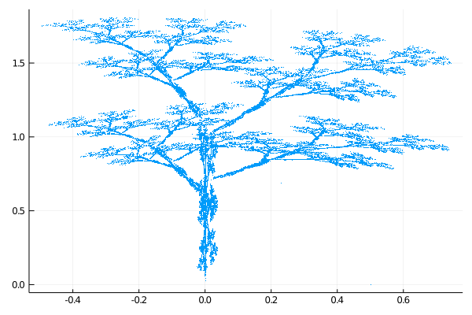
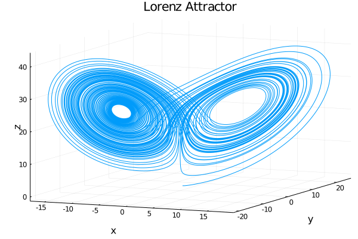

# Nonlinear_Dynamics_JL
Rewriting Fortran programs to Julia-lang.

## fractalgasket

## fractaltree

## langford
<!-- $$
\begin{eqnarray}
  \left\{
    \begin{array}{l}
      \frac{dx}{dt} = (z-u)x-wy \\
      \frac{dy}{dt} = wx-(z-u)y \\
      \frac{dz}{dt} = n+z-\frac{z^3}{3}-(x^2+y^2)(1+lz)+ezx^3
    \end{array}
  \right. \nonumber
\end{eqnarray}
$$ --> 

## logistic
<!-- $$
x_{n+1}=ax_n(1-x_n)
$$ --> 

## lorenz
<!-- $$
\begin{eqnarray}
  \left\{
    \begin{array}{l}
      \frac{dx}{dt} = -px+py \\
      \frac{dy}{dt} = -xz+rx-y \\
      \frac{dz}{dt} = xy-bz
    \end{array}
  \right. \nonumber
\end{eqnarray}
$$ --> 

## manderblot
<!-- $$
\begin{eqnarray}
z_{n+1}&=&z_n^2+c \nonumber \\
z_{n+1}&=&z_n^3+c \nonumber \\
z_{n+1}&=&z_n^4+c \nonumber \\
z_{n+1}&=&z_n^5+c \nonumber \\
z_{n+1}&=&\tan (z_n)+c \nonumber \\
z_{n+1}&=&\tan (z_n^4)+c \nonumber \\
z_{n+1}&=&\tan (z_n^27)+c \nonumber \\
z_{n+1}&=&\tan (z_n^256)+c \nonumber \\
z_{n+1}&=&\tan (z_n^3125)+c \nonumber
\end{eqnarray}
$$ --> 

## randomwalk
